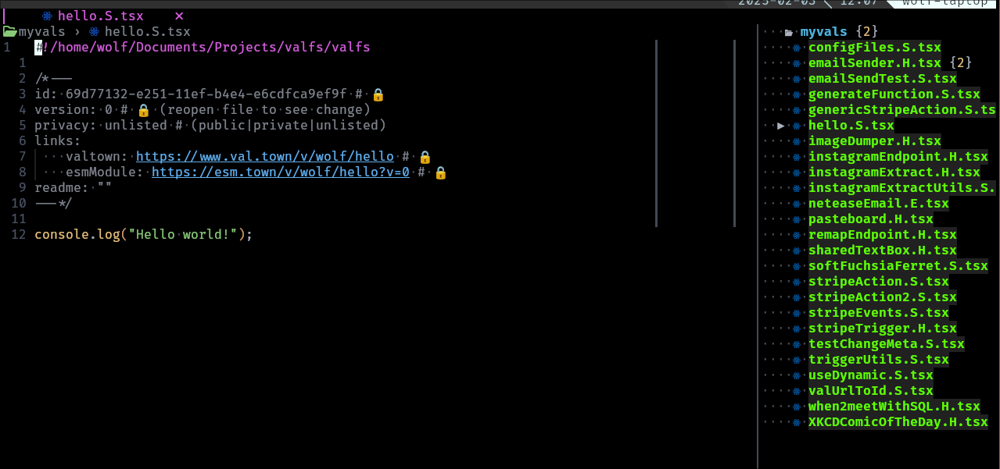
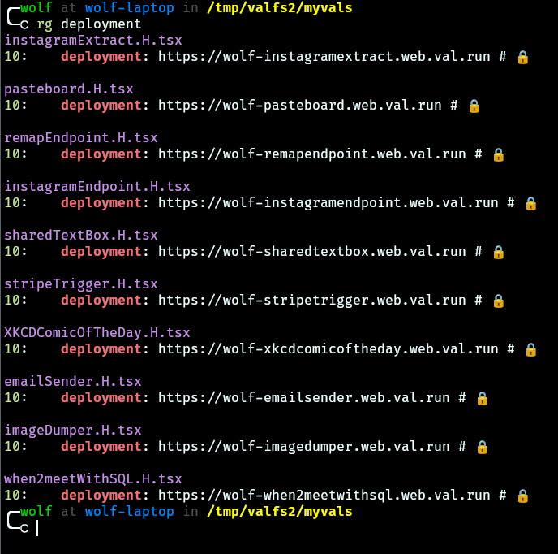
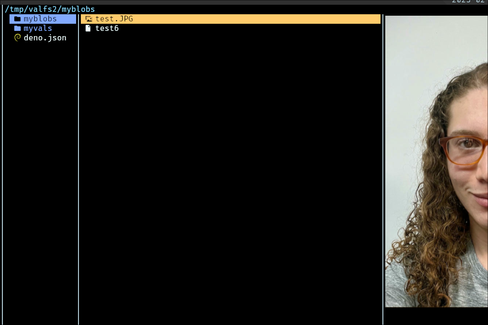

# Val Town File System

## Mount your Val Town vals to a folder, and edit them as if they were just files on your computer.

# Quick start

First, get [a build of valfs](https://github.com/404Wolf/valfs/releases).

Then, make a directory that you want to mount your vals to, for example, `mkdir
valfsDir`.

Now, set a `VAL_TOWN_API_KEY` environmental variable or add it to a `.env` file.

Next, ensure you have deno installed.

Finally, run

```
./valfs mount ./valfsDir
```

Now all your vals should show up as `.tsx` files under `./myvals`. You can:
- Edit them, and when you save new versions will automatically be created
- Delete them (be careful!)

## MacOS

To install on mac, do everything the same as linux, but first, install MacFuse.

Follow their steps [here](https://github.com/macfuse/macfuse/wiki/Getting-Started).
It's not that bad! MacFuse is pretty cool, it lets you run fuse programs (like
`valfs`, or even `rclone`) on macs.

On linux, everything should work. There's CI for Linux, but no CI for MacOS
because you cannot load kernel modules (required for using fuse) without a GUI
(since you have to approve in system preferences). If you find Mac bugs, let me
know!

# Using Valfs

At the top level, ValFS will create two folders, `myvals` and `myblobs`, and a
`deno.json`. The `deno.json` has settings to simulate val.town's development
environment. Deno will automatically cache all packages referenced in vals, so
that you get nice LSP completions.

When you update, remove, or create vals in `valfs` or on
`val.town`'s website, the opposite should automatically update to reflect
changes.

### Vals Directory

<p float="left">
  
  
</p>

In `myvals`, you'll see files that look like this, with metadata at the top
about the val. All fields without a 🔒 can be manually updated, and all fields
with a 🔒 will automatically be updated as you change the file. Depending on
what text editor you use, you may have to reload the file after saving.

```ts
#!/home/wolf/Documents/projects/Active/valfs/valfs

/*---
id: 4f3aff9c-c54b-11ef-b3a1-e6cdfca9ef9f # 🔒
version: 40 # 🔒
privacy: private # (public|private|unlisted)
links:
    valtown: https://www.val.town/v/wolf/test # 🔒
    esmModule: https://esm.town/v/wolf/test?v=40 # 🔒
    deployment: https://wolf-test.web.val.run # 🔒
readme: ""
---*/

console.log("Hello world!")
```

You can view all the metadata about the val (and the URL it is deployed to!),
and some of it you can edit. You can, of course, edit the actual val's content
as well.

You should be able to create new val files -- but make sure to name them
`name.(H|S|E).tsx`. You can also rename val files. If you rename a val file and
change the type, then you might see the metadata change (for example, HTTP ->
Email will add an email field and remove the deployment field).

To add a readme to a val, just add it to the metadata with a multiline yaml
field like below. Note the `-` to strip the leading newline.

```
readme: |-
    # My Project

    This is my readme!
---*/

console.log("Hello world!")
```

Also notice the magic shebang in the val files! Coming soon... you'll be able
to execute vals.

### Blobs Directory



The blobs directory, `myblobs`, is pretty simple. You can view, edit, rename,
or stat all your blob files. You can copy things in or out of this folder.

Internally, the files are fetched and referenced to temp files, so there is IO
when accessing this directory, to allow nice support for larger files. In the
future, small files might automatically be ram based instead.

# Known Issues

- When you "hop to definition" for a val town esm module (esm.town) val town
  serves deno modules with a name like "valname?v=22" without a ".tsx" at the
  end, so some editors won't give syntax highlighting. You can manually tell your
  editor it is `tsx`.

# Works in Progress

Disclaimer: this is still a work in progress! Soon, I will...

- Add execute support (in progress) so you can do ./myvals/foo.tsx and it runs
on val town's runtime and pipes logs to stdout (this will require a bit of
"reverse engineering" the API since it's internal)

# TODOs

Some of the TODOs hinge on Val Town improving their API and exposing more functionality

## Improvements
- add a queue for operations (e.g. deleting) to prevent API limits
- improve .env loading
- add logging
- metadata at top
- trash (to view previous versions)
- ValFiles should only have one val data reference, not two, or it should be 
  better documented how the lazy loading works.

## ValFile Operations
- rename
- move (out of folder)

## Configuration
Add options for:
- whether files should be executable
- whether to do lazy fetching

### Deno
- When you execute a val with ./, use
  `deno run --lock=path/to/the-real-lock.lock script.X.tsx` and have val town
  generate the lock file (with HTTP val wrapper + `Deno.readTextFile()` on
  lockfile)

